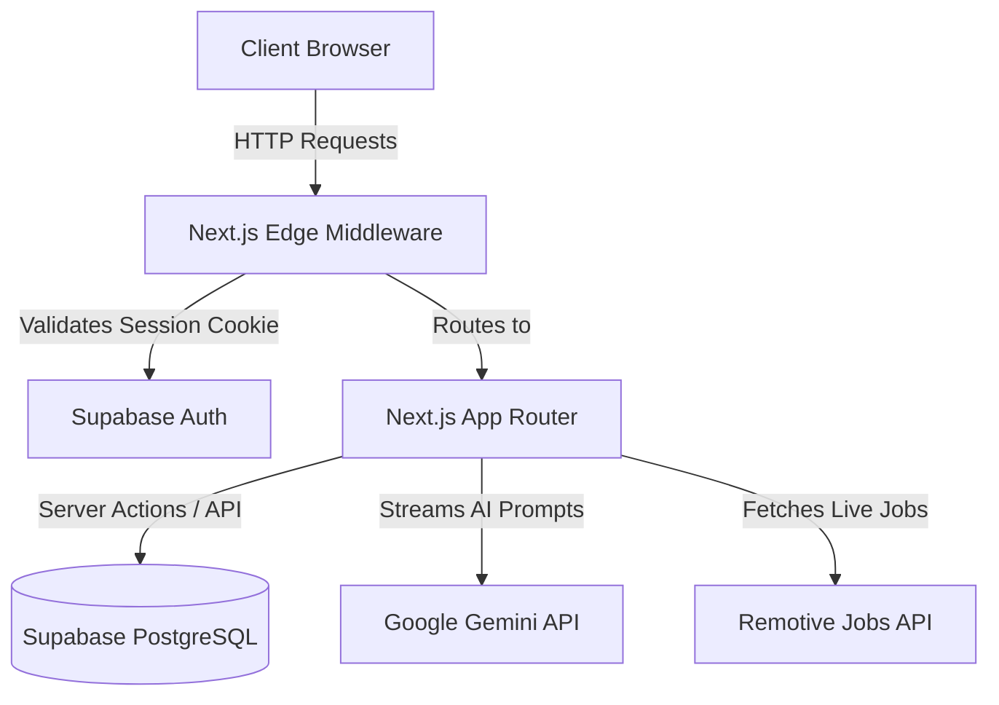

<!-- TODO: Add project logo -->

# SwipeHire

**The AI-Powered Job Discovery & Application Platform**  
*Swipe right on your dream job. Let AI handle the rest.*

[](https://nextjs.org/)
[](https://www.typescriptlang.org/)
[](https://supabase.com/)
[](https://deepmind.google/technologies/gemini/)
[](LICENSE)

---

## Overview

**SwipeHire** modernizes the grueling job search process by introducing an intuitive, Tinder-like swipe interface for job discovery. Built on a modern Edge-first stack (Next.js App Router, Supabase), it gamifies the candidate experience while leveraging **Google Gemini AI** to provide real-time resume tailoring, interview preparation, and ATS (Applicant Tracking System) compatibility scoring.

Whether you're a developer hunting for your next role or an open-source enthusiast exploring modern architectures, SwipeHire demonstrates how to build secure, scalable, and highly interactive applications.

## Features

| Feature | Description | Status |
| :--- | :--- | :---: |
| **Interactive Job Feed** | Tinder-style swiping interface to rapidly discover and save remote tech jobs. | ✅ |
| **AI Career Copilot** | Gemini-powered chat interface providing resume feedback and interview prep. | ✅ |
| **Automated ATS Scoring** | Instantly calculates resume match percentage against specific job descriptions. | ✅ |
| **Application Tracker** | Kanban-style dashboard to manage application statuses (Applied, Interview, Offer). | ✅ |
| **Edge Authentication** | Zero-latency route protection using `@supabase/ssr` middleware. | ✅ |

## Tech Stack

| Category | Technology | Purpose |
| :--- | :--- | :--- |
| **Framework** | Next.js 16 (App Router) | React framework, SSR, and API routing. |
| **Language** | TypeScript (Strict) | Type safety and developer experience. |
| **Database** | Supabase (PostgreSQL) | Relational data, RLS security policies. |
| **Authentication**| Supabase Auth | OAuth and secure HttpOnly cookie sessions. |
| **AI Integration**| Google GenAI SDK | Streaming responses via Gemini 2.5 Flash. |
| **Styling** | Tailwind CSS & shadcn/ui | Rapid, accessible UI component development. |
| **Validation** | Zod & `@t3-oss/env-nextjs` | Strict environment and schema validation. |

## Architecture

SwipeHire utilizes a secure, serverless architecture optimized for edge networks.



*For more details, see [Architecture Documentation](docs/architecture.md).*

## Folder Structure

```text
SwipeHire/
├── docs/                   # Extensive project documentation
├── frontend/               # Next.js Application Root
│   ├── app/                # App Router (Pages, Layouts, API Routes)
│   ├── components/         # React Components (UI, Jobs, Chat)
│   ├── hooks/              # Custom React Hooks (useSwipe, etc.)
│   ├── lib/                # Utilities (Supabase, AI Prompts, Types)
│   └── public/             # Static Assets (Images, Icons)
├── supabase/               # Database schemas and migrations
└── README.md               # You are here
```

## Screenshots

*Screenshots coming soon.*

## Demo

*Live demo link coming soon.*

## Installation

### Prerequisites
- Node.js 20+
- npm or pnpm
- A Supabase Project
- A Google Gemini API Key

### Steps

1. **Clone the repository**
   ```bash
   git clone https://github.com/yourusername/swipehire.git
   cd swipehire/frontend
   ```

2. **Install dependencies**
   ```bash
   npm install
   ```

## Environment Variables

Create a `.env.local` file in the `frontend/` directory using `.env.example` as a template. The project uses `@t3-oss/env-nextjs` to strictly enforce these at build time.

| Variable | Required | Description |
| :--- | :---: | :--- |
| `GEMINI_API_KEY` | Yes | Google Gemini API Key for the Copilot. |
| `JOBS_API_URL` | Yes | The external API endpoint (e.g., Remotive). |
| `NEXT_PUBLIC_SUPABASE_URL` | Yes | Your Supabase Project URL. |
| `NEXT_PUBLIC_SUPABASE_ANON_KEY`| Yes | Your Supabase Anonymous Key. |

## Running Locally

Once dependencies are installed and environment variables are set:

```bash
npm run dev
```

The application will be available at [http://localhost:3000](http://localhost:3000).

## Deployment

SwipeHire is optimized for Vercel.

1. Push your repository to GitHub.
2. Log into [Vercel](https://vercel.com/) and click **Add New Project**.
3. Import your SwipeHire repository.
4. Set the **Root Directory** to `frontend`.
5. Under **Environment Variables**, copy over all values from your `.env.local`.
6. Click **Deploy**.

*For more details, see [Deployment Documentation](docs/deployment.md).*

## API Overview

Internal API routes act as secure proxies to external services:
- `GET /api/jobs`: Fetches job listings from the external provider. Uses Next.js Route Caching (`revalidate = 3600`) to prevent rate limits.
- `POST /api/chat`: Handles AI prompt generation and streams Gemini responses to the client.

## AI Features

SwipeHire integrates Google Gemini 2.5 Flash via Edge API routes to provide:
- **Streaming Responses**: The `/api/chat` route utilizes `ReadableStream` to stream AI chunks directly to the UI without blocking.
- **Strict Prompt Engineering**: Hidden system prompts (`lib/ai/prompts`) constrain the AI to act exclusively as a technical recruiter and prevent prompt injection.

*For more details, see [AI Flow Documentation](docs/ai-flow.md).*

## Roadmap

- [ ] **Global Rate Limiting**: Implement Upstash Redis for Edge-native rate limiting on API routes.
- [ ] **Automated Testing**: Add Cypress E2E tests and Jest unit tests for AI prompts.
- [ ] **Keyboard Navigation**: Add Left/Right Arrow key listeners to the SwipeStack component.
- [ ] **OAuth Integrations**: Allow users to import their LinkedIn profiles directly.

*For more details, see [Future Roadmap Documentation](docs/future-roadmap.md).*

## Contributing

We welcome contributions! Please review our [Contributing Guidelines](CONTRIBUTING.md) and [Code of Conduct](CODE_OF_CONDUCT.md) before submitting pull requests.

## License

This project is licensed under the MIT License - see the [LICENSE](LICENSE) file for details.
