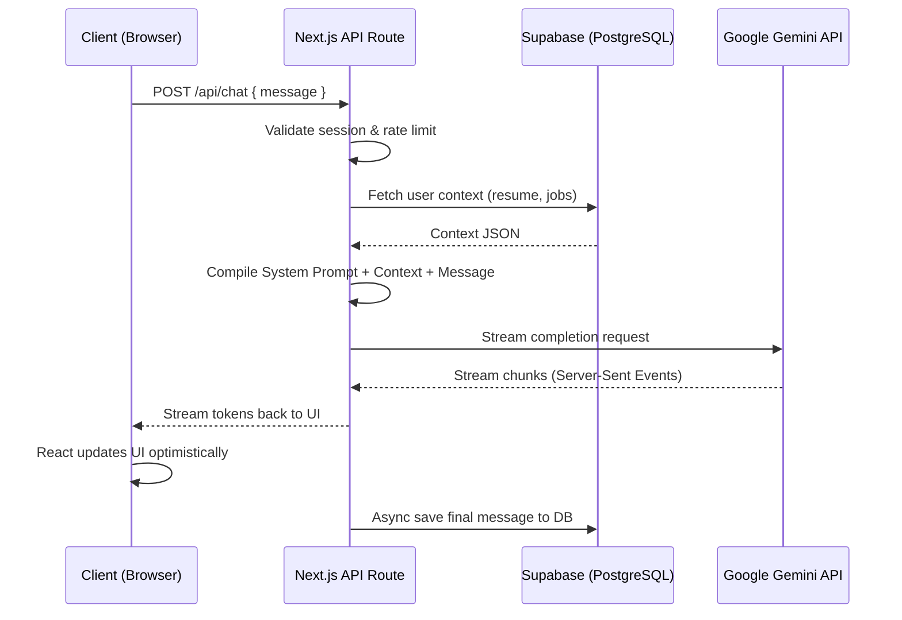
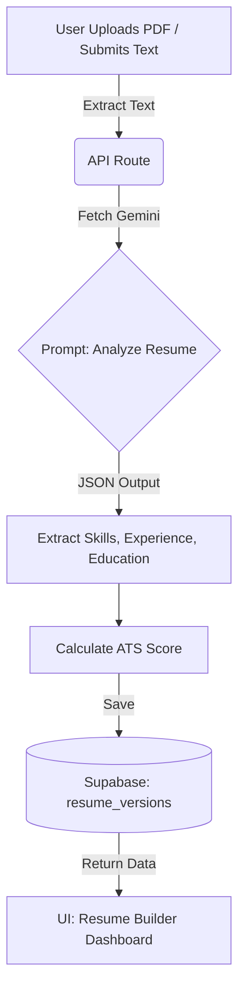
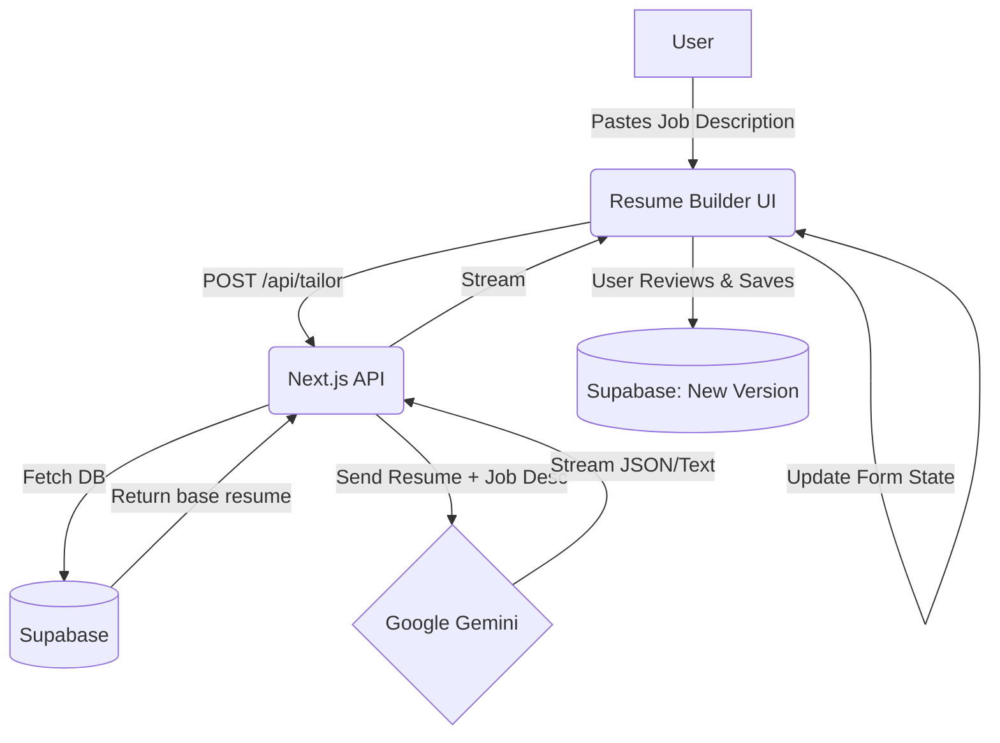
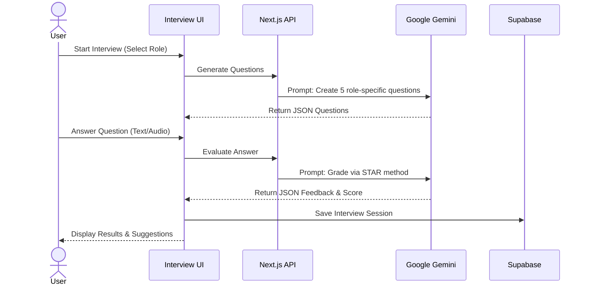

# AI Pipelines and Data Flows

SwipeHire integrates Google Gemini for multiple distinct AI workflows. Below are the architectural flow diagrams for each primary AI feature.

## 1. AI Request Lifecycle



## 2. Resume Analysis Flow



## 3. Resume Tailoring Flow



## 4. Career Copilot Flow

```mermaid
graph LR
    User((User)) -->|Types Message| ChatUI[Copilot Chat]
    ChatUI -->|Message History| API[Next.js API]
    API <-->|R/W Chat History| DB[(Supabase)]
    API <-->|R/W Context (Saved Jobs/Resumes)| DB
    API -->|Prompt + Context| Gemini[Google Gemini]
    Gemini -->|Streaming Response| ChatUI
```

## 5. Mock Interview Flow


