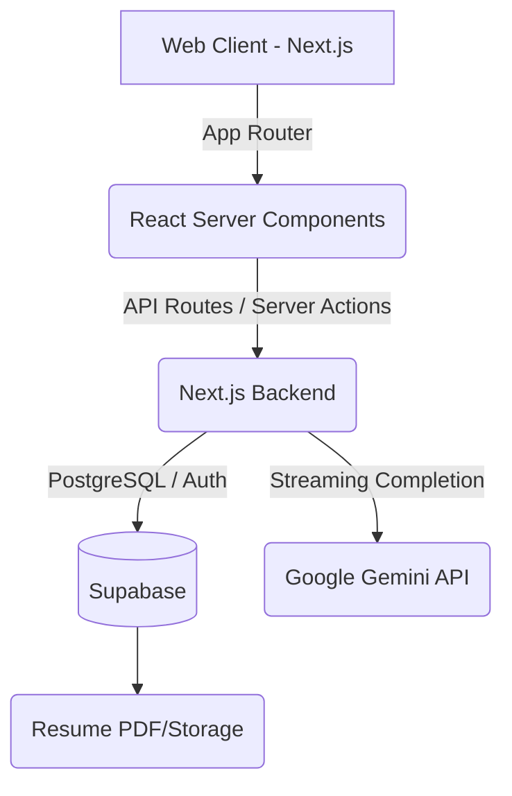
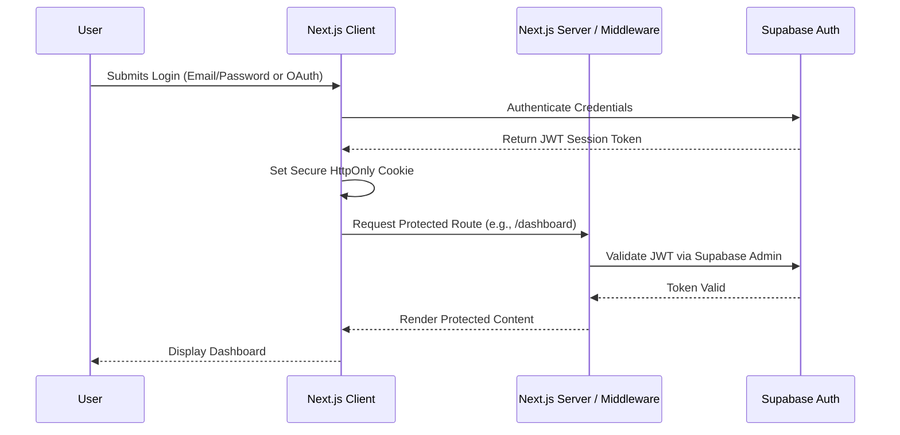

# System Architecture

SwipeHire is built on a modern, decoupled serverless architecture to ensure rapid global delivery, secure data management, and responsive AI integrations.

## 1. High-Level System Architecture

## 2. Authentication Flow

SwipeHire leverages Supabase Auth for seamless user identity management.

