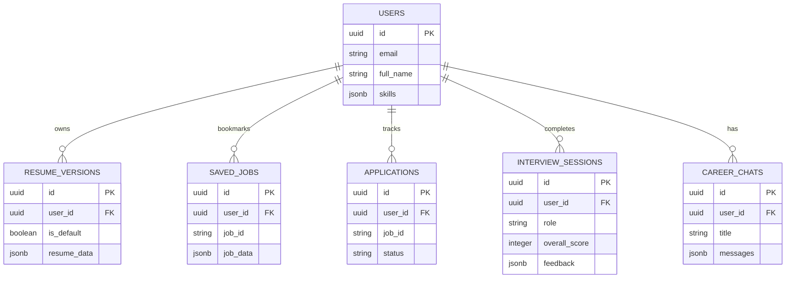
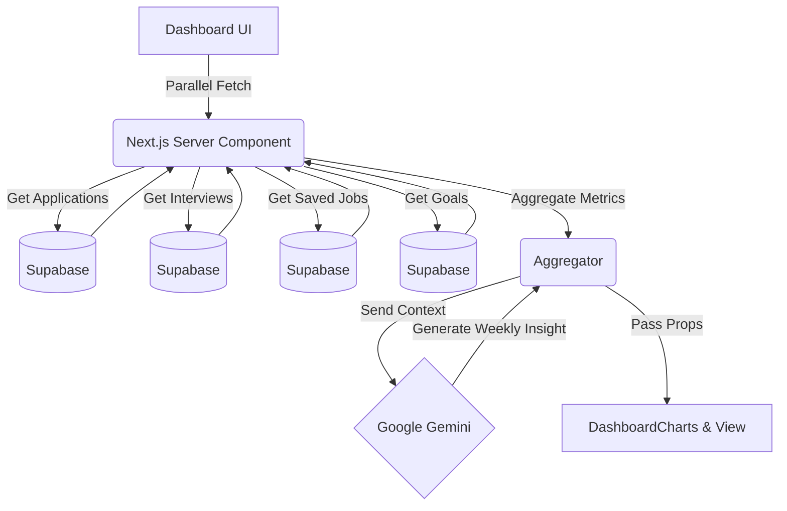

# Database Architecture

SwipeHire uses Supabase (PostgreSQL) as its primary data store. 

## 1. Database Schema (Entity Relationship)



## 2. Dashboard Analytics Flow



## Security (Row Level Security)
Every table implements Row Level Security.
Example RLS Policy:
```sql
CREATE POLICY "Users can only view their own applications" 
ON applications FOR SELECT 
USING (auth.uid() = user_id);
```
