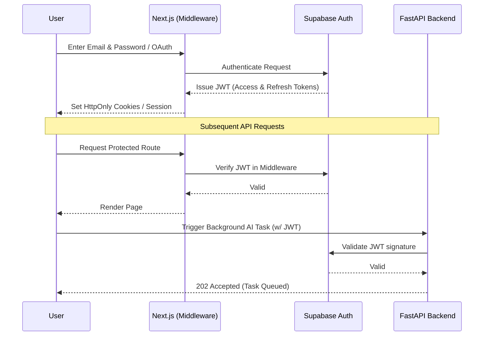

# Security Architecture

Security is a first-class citizen in SwipeHire, utilizing modern authentication patterns and database-level security.

## Authentication Flow Diagram

## Core Security Pillars

### 1. Supabase Auth
SwipeHire uses Supabase Auth for managing user identities. Passwords are cryptographically hashed, and sessions are managed securely using JWTs.

### 2. Row Level Security (RLS)
The Supabase PostgreSQL database enforces RLS. Even if the backend API is somehow compromised or bypassed, the database itself refuses to serve data that doesn't belong to the authenticated user requesting it.
- **Example**: `CREATE POLICY "Users can only view their own resumes" ON resume_versions FOR SELECT USING (auth.uid() = user_id);`

### 3. Next.js Middleware Route Protection
Unauthenticated users attempting to access dashboard or application tracking routes are intercepted at the edge by Next.js middleware and redirected to the login page, preventing unnecessary rendering or API calls.

### 4. API Key Protection
- The Google Gemini API key is heavily restricted.
- The `SUPABASE_SERVICE_KEY` is ONLY available to the secure Python backend and never exposed to the frontend. The frontend uses the strictly scoped `anon` key.

### 5. Input Validation
All API endpoints and form submissions use strong schema validation (`zod` on the frontend, `pydantic` on the backend) to prevent injection attacks and ensure data integrity.
